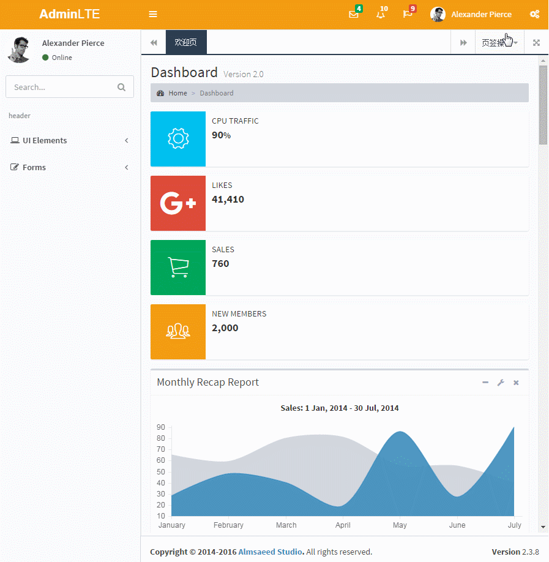
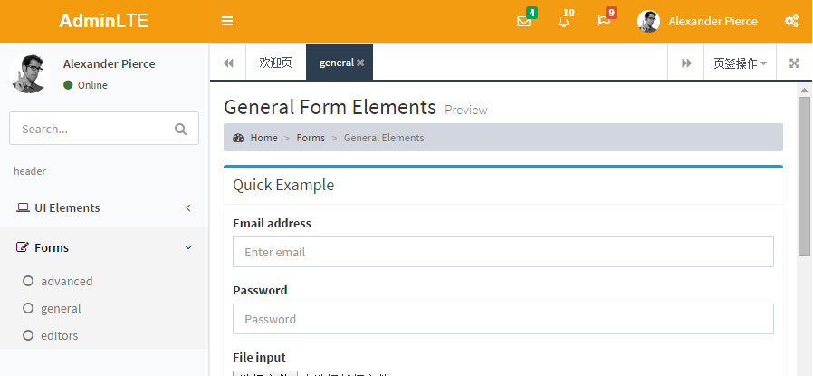

Introduction(简介)
================

**AdminLTE with iframe** -- Based on **AdminLTE** framework. It integrated with iframes with is popular in china admin systems.

(基于AdminLTE框架,并且集成了iframe的tab页面,是一款适合中国国情的后台系统)

**Preview on [https://weituotian.github.io/AdminLTE-With-Iframe/pages/index_iframe.html](https://weituotian.github.io/AdminLTE-With-Iframe/pages/index_iframe.html)**

branch(分支)
----------
更新分支为iframe

reference(参考)
-------------
**[super ui](https://github.com/tzhsweet/superui)**

(iframe功能的js和页面css都是参考superui得出来的)

Installation(安装)
----------------
修改可以使用grunt构建工具

- 安装nodejs
- 根目录下命令行执行
- npm install

Documentation(文档)
-----------------
may be you should **customize** the system by reading the codes!

(请阅读源码进行修改)

Browser Support(浏览器支持)
----------------------
- IE 9+
- Firefox (latest)
- Chrome (latest)
- Safari (latest)
- Opera (latest)

License
-------
AdminLTE is an open source project by [Almsaeed Studio](https://almsaeedstudio.com) that is licensed under [MIT](http://opensource.org/licenses/MIT). Almsaeed Studio

reserves the right to change the license of future releases.

(开源免费)

Todo List
---------
- jquery pace integration
