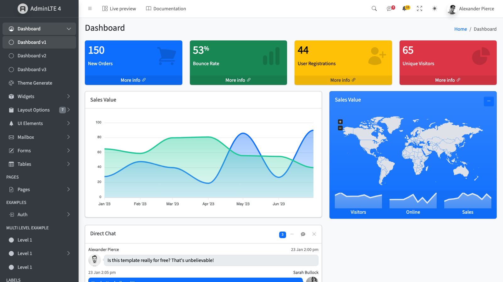
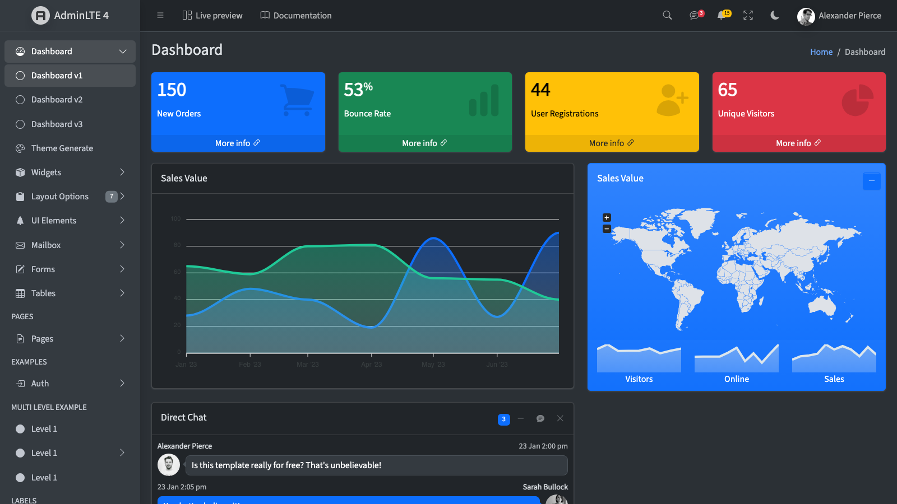
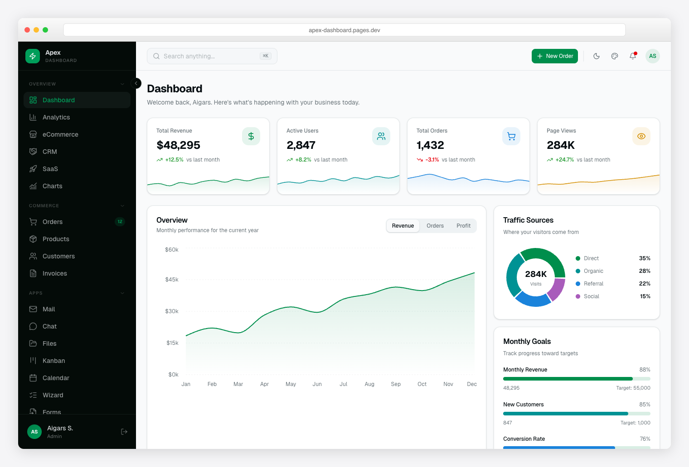
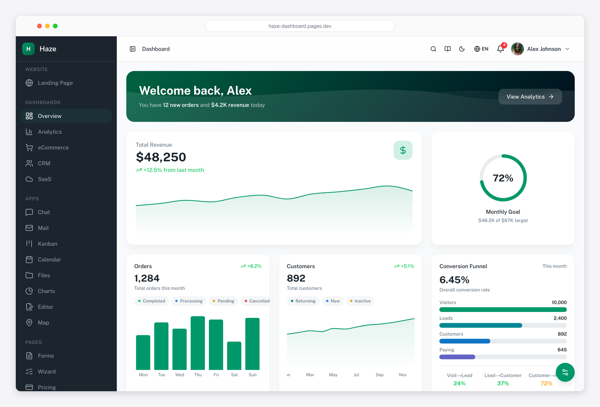

# [AdminLTE — Bootstrap 5 Admin Dashboard](https://adminlte.io)

[](https://www.npmjs.com/package/admin-lte)
[](https://packagist.org/packages/almasaeed2010/adminlte)
[](https://www.jsdelivr.com/package/npm/admin-lte)
[](https://opensource.org/licenses/MIT)
[](https://discord.gg/jfdvjwFqfz)
[](https://app.netlify.com/sites/adminlte-v4/deploys)

**AdminLTE** is the most popular open-source admin dashboard template — fully responsive,
built on **[Bootstrap 5.3](https://getbootstrap.com/)** with vanilla JavaScript (no jQuery),
highly customizable, and easy to use. It fits every screen from small mobile devices to
large desktops, and it's MIT-licensed.

**[Live Demo](https://adminlte.io/themes/v4/)** ·
**[Documentation](https://adminlte.io/themes/v4/docs/introduction.html)** ·
**[Framework Editions](#framework-editions)** ·
**[Premium Templates](#premium-templates)**

<p align="center">
  <a href="https://adminlte.io/themes/v4/">
    
  </a>
  <a href="https://adminlte.io/themes/v4/">
    
  </a>
</p>

## Framework editions

The same AdminLTE 4 dashboard, officially integrated for the framework you know best —
you're looking at the **HTML / Bootstrap** core:

<p align="center">
  <a href="https://github.com/ColorlibHQ/adminlte-react"></a>
  <a href="https://github.com/ColorlibHQ/adminlte-react"></a>
  <a href="https://github.com/ColorlibHQ/adminlte-vue"></a>
  <a href="https://github.com/ColorlibHQ/adminlte-vue"></a>
  <a href="https://github.com/ColorlibHQ/adminlte-laravel"></a>
  <a href="https://github.com/ColorlibHQ/adminlte-django"></a>
</p>

| Edition | Repository | Live demo | Install |
|---|---|---|---|
| **HTML / Bootstrap** (this repo) | [AdminLTE](https://github.com/ColorlibHQ/AdminLTE) | [themes/v4](https://adminlte.io/themes/v4/) | `npm install admin-lte` |
| **React & Next.js** — 30+ typed components, RSC-ready, ⌘K palette | [adminlte-react](https://github.com/ColorlibHQ/adminlte-react) | [themes/next-react](https://adminlte.io/themes/next-react/) | see repo |
| **Vue 3 & Nuxt** — 45+ typed components, composables, SSR-safe theming | [adminlte-vue](https://github.com/ColorlibHQ/adminlte-vue) | [themes/vue-nuxt](https://adminlte.io/themes/vue-nuxt/) | see repo |
| **Laravel** — Blade components, config-driven menu, auth scaffolding | [adminlte-laravel](https://github.com/ColorlibHQ/adminlte-laravel) | [laravel.adminlte.io](https://laravel.adminlte.io/) | `composer require colorlibhq/adminlte-laravel` |
| **Django** — reusable app, menu filter pipeline, themed admin | [adminlte-django](https://github.com/ColorlibHQ/adminlte-django) | [django.adminlte.io](https://django.adminlte.io/) | `pip install django-adminlte4` |

Every edition ships the full AdminLTE 4 design — Bootstrap 5.3, dark mode, RTL — with
idiomatic integrations for its stack (components, routing, auth, theming).

## Quick start

**CDN** — no build step:

```html
<link rel="stylesheet" href="https://cdn.jsdelivr.net/npm/admin-lte@4/dist/css/adminlte.min.css">
<script src="https://cdn.jsdelivr.net/npm/admin-lte@4/dist/js/adminlte.min.js"></script>
```

**npm:**

```bash
npm install admin-lte@4
```

**Composer:**

```bash
composer require almasaeed2010/adminlte
```

Then start from the [Getting Started guide](https://adminlte.io/themes/v4/docs/introduction.html)
or copy one of the demo pages.

### Developing AdminLTE itself

1. **Install dependencies:** `npm install`
2. **Start the dev server:** `npm start` *(opens http://localhost:3000 with live reload)*
3. **Build:** `npm run build` — or `npm run production` for the full lint + optimize + bundlewatch pipeline

<details>
<summary>All npm scripts</summary>

- `npm start` — development server with file watching
- `npm run build` — build all assets for development
- `npm run production` — full production build with linting and bundlewatch
- `npm run lint` — run all linters (JS, CSS, docs, lockfile)
- `npm run css` — build CSS only
- `npm run js` — build JavaScript only

</details>

## What's new in v4

The v4 line is a ground-up rewrite on Bootstrap 5.3 with **no jQuery**: 18 new demo pages
(Calendar, Kanban, Chat, File Manager, Mailbox, Wizard, Tabulator data tables, and more),
a documentation overhaul, and major dependency upgrades. See the
[CHANGELOG](CHANGELOG.md) for full details.

<details>
<summary>Highlights</summary>

**18 new demo pages**

- Apps: Calendar (FullCalendar), Kanban (SortableJS), Chat, File Manager, Projects, Mailbox (Inbox / Read / Compose)
- Forms: Wizard (4-step with validation)
- Tables: Data Tables (Tabulator — jQuery-free)
- Pages: Profile, Settings, Invoice, Pricing, FAQ
- Errors: 404, 500, Maintenance

**Documentation overhaul**

- New pages: Getting Started, Customization & Theming, RTL Support, Migration from v3, Layout Blueprint, Recipes, Deployment & Performance, Recommended Integrations, JavaScript Plugins Overview
- Rewritten Introduction with four labelled install paths (CDN / npm / source / Composer)
- FAQ rebuilt with hero, live search, section chips, and an accordion of 19 questions
- Split sidebar navigation: dashboard demo and docs each have their own nav

**Major dependency upgrades**

- ESLint 10, TypeScript 6, Stylelint 17, Astro 6.3, Bootstrap 5.3.8, Node 22 LTS in CI
- `npm install` runs clean with **0 vulnerabilities**

</details>

<details>
<summary>Breaking changes from v3</summary>

- Class renames: `.wrapper` → `.app-wrapper`, `.main-header` → `.app-header`, `.main-sidebar` → `.app-sidebar`, `.content-wrapper` → `.app-main`
- Data attributes: `data-toggle` → `data-bs-toggle`, `data-widget="pushmenu"` → `data-lte-toggle="sidebar"`, `data-widget="treeview"` → `data-lte-toggle="treeview"`
- Dark mode: `.dark-mode` body class → `data-bs-theme="dark"` attribute (Bootstrap 5.3 native)
- jQuery no longer required; plugins are vanilla TypeScript

See the dedicated [Migration from v3](https://adminlte.io/themes/v4/docs/migration.html) guide.

</details>

## Premium templates

AdminLTE will always be free and open source. When a project needs more —
app-ready pages, framework-native codebases, dedicated support — our team
hand-picks premium dashboards at **[adminlte.io/premium](https://adminlte.io/premium)**,
including editions built for the same stacks AdminLTE integrates with:

<table>
  <tr>
    <td align="center" width="50%">
      <a href="https://dashboardpack.com/theme-details/admindek-html/?utm_source=github&utm_medium=readme&utm_campaign=adminlte">
        
      </a>
      <br>
      <a href="https://dashboardpack.com/theme-details/admindek-html/?utm_source=github&utm_medium=readme&utm_campaign=adminlte"><strong>Admindek</strong></a>
      <br>
      <sub>The natural next step from AdminLTE: Bootstrap 5 + vanilla JS, 100+ components, dark/light modes, RTL, 10 color presets.<br>
      Also for <a href="https://dashboardpack.com/theme-details/admindek-dashboard-laravel/?utm_source=github&utm_medium=readme&utm_campaign=adminlte">Laravel</a> ·
      <a href="https://dashboardpack.com/theme-details/admindek-nextjs/?utm_source=github&utm_medium=readme&utm_campaign=adminlte">Next.js</a> ·
      <a href="https://dashboardpack.com/theme-details/admindek-dashboard-angular/?utm_source=github&utm_medium=readme&utm_campaign=adminlte">Angular</a></sub>
    </td>
    <td align="center" width="50%">
      <a href="https://dashboardpack.com/theme-details/apex-dashboard-nextjs/?utm_source=github&utm_medium=readme&utm_campaign=adminlte">
        
      </a>
      <br>
      <a href="https://dashboardpack.com/theme-details/apex-dashboard-nextjs/?utm_source=github&utm_medium=readme&utm_campaign=adminlte"><strong>Apex Dashboard</strong></a>
      <br>
      <sub>5 dashboard variants, 20+ app pages, 125+ routes, full CRUD — in your backend's native stack.<br>
      For <a href="https://dashboardpack.com/theme-details/apex-dashboard-nextjs/?utm_source=github&utm_medium=readme&utm_campaign=adminlte">Next.js</a> ·
      <a href="https://dashboardpack.com/theme-details/apex-dashboard-laravel/?utm_source=github&utm_medium=readme&utm_campaign=adminlte">Laravel</a> ·
      <a href="https://dashboardpack.com/theme-details/apex-dashboard-django/?utm_source=github&utm_medium=readme&utm_campaign=adminlte">Django</a> ·
      <a href="https://dashboardpack.com/theme-details/apex-dashboard-angular/?utm_source=github&utm_medium=readme&utm_campaign=adminlte">Angular</a></sub>
    </td>
  </tr>
  <tr>
    <td align="center" width="50%">
      <a href="https://dashboardpack.com/theme-details/zenith-dashboard-django/?utm_source=github&utm_medium=readme&utm_campaign=adminlte">
        
      </a>
      <br>
      <a href="https://dashboardpack.com/theme-details/zenith-dashboard-django/?utm_source=github&utm_medium=readme&utm_campaign=adminlte"><strong>Zenith Dashboard — Django</strong></a>
      <br>
      <sub>Achromatic, ultra-minimal design as a ready-to-run Django project: 50+ pages, 6 dashboards, live theme customizer.</sub>
    </td>
    <td align="center" width="50%">
      <a href="https://dashboardpack.com/theme-details/haze-dashboard-nuxt/?utm_source=github&utm_medium=readme&utm_campaign=adminlte">
        
      </a>
      <br>
      <a href="https://dashboardpack.com/theme-details/haze-dashboard-nuxt/?utm_source=github&utm_medium=readme&utm_campaign=adminlte"><strong>Haze — Nuxt</strong></a>
      <br>
      <sub>Nuxt 4 + Nuxt UI v4 + Tailwind CSS v4. 92+ pages, 7 layouts, 5 dashboards, RTL, i18n, mock API layer.</sub>
    </td>
  </tr>
</table>

<p align="center">
  <a href="https://adminlte.io/premium"><strong>View all premium templates →</strong></a>
</p>

## Browser & platform support

AdminLTE supports the latest versions of all modern browsers (Chrome, Firefox, Safari,
Edge) via Bootstrap 5.3.8. The build scripts run cross-platform — Windows (CMD,
PowerShell, Git Bash), macOS and Linux — using cross-platform npm utilities throughout.

## Security & production deployment

AdminLTE is a **UI template**. Deploy only the compiled production assets
(`dist/js/adminlte.min.js`, `dist/css/adminlte.min.css`) and your own application files —
never `node_modules/`, the demo HTML pages, or the `src/` directory.

> **About CVE-2021-36471:** this CVE is **disputed** and does not represent a
> vulnerability in AdminLTE — it refers to demo pages being accessible when example
> files are incorrectly deployed to production. AdminLTE v4 cleanly separates
> development demos from production assets.

For detailed guidelines, authentication requirements, and best practices, see
[SECURITY.md](SECURITY.md).

## Sponsorship

Support AdminLTE development by becoming a sponsor or donor.

<p align="center">
  <a href="https://github.com/sponsors/danny007in">
    
  </a>
  &nbsp;&nbsp;
  <a href="https://www.paypal.me/daniel007in">
    
  </a>
</p>

### Our sponsors

<p align="center">
  <a href="https://github.com/spizzo14"></a>&nbsp;&nbsp;
  <a href="https://github.com/tomhappyblock"></a>&nbsp;&nbsp;
  <a href="https://github.com/stefanmorderca"></a>&nbsp;&nbsp;
  <a href="https://github.com/tito10047"></a>&nbsp;&nbsp;
  <a href="https://github.com/sitchi"></a>&nbsp;&nbsp;
  <a href="https://github.com/npreee"></a>&nbsp;&nbsp;
  <a href="https://github.com/isaacmorais"></a>&nbsp;&nbsp;
</p>

<p align="center">
  <a href="https://github.com/sponsors/danny007in">Your avatar here? Become a sponsor</a>
</p>

## Contributing

Contributions are highly welcome:

1. Install [Node.js](https://nodejs.org/) (LTS) and clone this repository (`master` branch).
2. `npm install`, then `npm start` to run the dev server.
3. Make your changes (run `npm run lint` before committing) and open a PR against `master`.

## License

AdminLTE is an open source project by [AdminLTE.io](https://adminlte.io) licensed under
[MIT](https://opensource.org/licenses/MIT). AdminLTE.io reserves the right to change
the license of future releases.

## Image credits

[Pixeden](http://www.pixeden.com/psd-web-elements/flat-responsive-showcase-psd),
[Graphicsfuel](https://www.graphicsfuel.com/2013/02/13-high-resolution-blur-backgrounds/),
[Pickaface](https://pickaface.net/),
[Unsplash](https://unsplash.com/),
[Uifaces](http://uifaces.com/),
[Unavatar](https://unavatar.io/)
