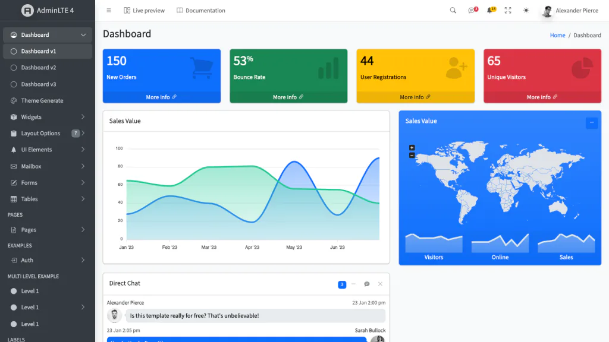

# [AdminLTE — Bootstrap 5 Admin Dashboard](https://adminlte.io)

[](https://www.npmjs.com/package/admin-lte)
[](https://packagist.org/packages/almasaeed2010/adminlte)
[](https://www.jsdelivr.com/package/npm/admin-lte)
[](https://opensource.org/licenses/MIT)
[](https://discord.gg/jfdvjwFqfz)
[](https://app.netlify.com/sites/adminlte-v4/deploys)

**AdminLTE** is the most popular open-source admin dashboard template — fully responsive,
built on **[Bootstrap 5.3](https://getbootstrap.com/)** with vanilla JavaScript (no jQuery),
highly customizable, and easy to use. It fits every screen from small mobile devices to
large desktops, and it's MIT-licensed.

**[Live Demo](https://adminlte.io/themes/v4/)** ·
**[Documentation](https://adminlte.io/themes/v4/docs/introduction.html)** ·
**[Framework Editions](#framework-editions)** ·
**[Premium Templates](#premium-templates)**

<p align="center">
  <a href="https://adminlte.io/themes/v4/">
    
  </a>
  <a href="https://adminlte.io/themes/v4/">
    
  </a>
</p>

## Framework editions

The same AdminLTE 4 dashboard, officially integrated for the framework you know best —
you're looking at the **HTML / Bootstrap** core:

<!-- ADMINLTE-ECOSYSTEM:START -->
<div align="center">
  <a href="https://github.com/ColorlibHQ/AdminLTE"></a>
  <a href="https://github.com/ColorlibHQ/adminlte-react"></a>
  <a href="https://github.com/ColorlibHQ/adminlte-react"></a>
  <a href="https://github.com/ColorlibHQ/adminlte-vue"></a>
  <a href="https://github.com/ColorlibHQ/adminlte-vue"></a>
  <a href="https://github.com/ColorlibHQ/adminlte-angular"></a>
  <a href="https://github.com/ColorlibHQ/adminlte-laravel"></a>
  <a href="https://github.com/ColorlibHQ/adminlte-symfony"></a>
  <a href="https://github.com/ColorlibHQ/adminlte-django"></a>
  <a href="https://github.com/ColorlibHQ/adminlte-aspnet"></a>
  <a href="https://github.com/ColorlibHQ/adminlte-drupal"></a>
  <a href="https://docs.adminlte.io"></a>
</div>
<!-- ADMINLTE-ECOSYSTEM:END -->

| Edition | Repository | Live demo | Install |
|---|---|---|---|
| **HTML / Bootstrap** (this repo) | [AdminLTE](https://github.com/ColorlibHQ/AdminLTE) | [themes/v4](https://adminlte.io/themes/v4/) | `npm install admin-lte` |
| **React & Next.js** — 30+ typed components, RSC-ready, ⌘K palette | [adminlte-react](https://github.com/ColorlibHQ/adminlte-react) | [themes/next-react](https://adminlte.io/themes/next-react/) | see repo |
| **Vue 3 & Nuxt** — 45+ typed components, composables, SSR-safe theming | [adminlte-vue](https://github.com/ColorlibHQ/adminlte-vue) | [themes/vue-nuxt](https://adminlte.io/themes/vue-nuxt/) | see repo |
| **Laravel** — Blade components, config-driven menu, auth scaffolding | [adminlte-laravel](https://github.com/ColorlibHQ/adminlte-laravel) | [laravel.adminlte.io](https://laravel.adminlte.io/) | `composer require colorlibhq/adminlte-laravel` |
| **Django** — reusable app, menu filter pipeline, themed admin | [adminlte-django](https://github.com/ColorlibHQ/adminlte-django) | [django.adminlte.io](https://django.adminlte.io/) | `pip install django-adminlte4` |
| **Symfony** — Twig Components, AssetMapper, config-driven menu, EasyAdmin theme | [adminlte-symfony](https://github.com/ColorlibHQ/adminlte-symfony) | see repo | `composer require colorlibhq/adminlte-symfony` |
| **Angular 22** — 44 standalone signal components, dark mode, ⌘K palette | [adminlte-angular](https://github.com/ColorlibHQ/adminlte-angular) | see repo | `npm i @adminlte/angular` |
| **ASP.NET Core (.NET 10)** — Blazor components + MVC/Razor Pages Tag Helpers | [adminlte-aspnet](https://github.com/ColorlibHQ/adminlte-aspnet) | see repo | `dotnet add package ColorlibHQ.AdminLTE.AspNetCore` |
| **Drupal** — admin theme for Drupal 10.3+/11, themed admin UI | [adminlte-drupal](https://github.com/ColorlibHQ/adminlte-drupal) | see repo | see repo |
| **Docs** — guides, components, and API reference for every edition | [docs.adminlte.io](https://docs.adminlte.io) | [docs.adminlte.io](https://docs.adminlte.io) | — |

Every edition ships the full AdminLTE 4 design — Bootstrap 5.3, dark mode, RTL — with
idiomatic integrations for its stack (components, routing, auth, theming).

## Quick start

**CDN** — no build step:

```html
<link rel="stylesheet" href="https://cdn.jsdelivr.net/npm/admin-lte@4/dist/css/adminlte.min.css">
<script src="https://cdn.jsdelivr.net/npm/admin-lte@4/dist/js/adminlte.min.js"></script>
```

**npm:**

```bash
npm install admin-lte@4
```

**Composer:**

```bash
composer require almasaeed2010/adminlte
```

Then start from the [Getting Started guide](https://adminlte.io/themes/v4/docs/introduction.html)
or copy one of the demo pages.

### Developing AdminLTE itself

1. **Install dependencies:** `npm install`
2. **Start the dev server:** `npm start` *(opens http://localhost:3000 with live reload)*
3. **Build:** `npm run build` — or `npm run production` for the full lint + optimize + bundlewatch pipeline

<details>
<summary>All npm scripts</summary>

- `npm start` — development server with file watching
- `npm run build` — build all assets for development
- `npm run production` — full production build with linting and bundlewatch
- `npm run lint` — run all linters (JS, CSS, docs, lockfile)
- `npm run css` — build CSS only
- `npm run js` — build JavaScript only

</details>

## What's new in v4

The v4 line is a ground-up rewrite on Bootstrap 5.3 with **no jQuery**: 18 new demo pages
(Calendar, Kanban, Chat, File Manager, Mailbox, Wizard, Tabulator data tables, and more),
a documentation overhaul, and major dependency upgrades. See the
[CHANGELOG](CHANGELOG.md) for full details.

### New in 4.3

- **Sidebar search** — a new `SidebarSearch` plugin filters the menu as you type, expanding
  whatever submenu holds a match and restoring the menu exactly as it was when cleared.
  Paired with a navbar search in the app header.
- **Ribbons** — corner banners (`.ribbon-wrapper` + `.ribbon`) in three sizes, mirrored
  automatically in RTL, with the clip following the card's corner radius.
- **Social & post widgets** — `.user-block`, `.post`, `.widget-user`, `.widget-user-2` and
  `.description-block`, laid out with grid and flex.
- **Three new demo pages** — Gallery (filterable media library, no image library required),
  Search Results (typed results with a refine panel), and Ribbons.
- **Nav tabs, modals and offcanvas** added to the General UI Elements showcase.
- **Card and Miscellaneous docs pages**, plus a language switcher recipe — every component
  that ships CSS now has a reference page.

<details>
<summary>Highlights</summary>

**18 new demo pages**

- Apps: Calendar (FullCalendar), Kanban (SortableJS), Chat, File Manager, Projects, Mailbox (Inbox / Read / Compose)
- Forms: Wizard (4-step with validation)
- Tables: Data Tables (Tabulator — jQuery-free)
- Pages: Profile, Settings, Invoice, Pricing, FAQ
- Errors: 404, 500, Maintenance

**Documentation overhaul**

- New pages: Getting Started, Customization & Theming, RTL Support, Migration from v3, Layout Blueprint, Recipes, Deployment & Performance, Recommended Integrations, JavaScript Plugins Overview
- Rewritten Introduction with four labelled install paths (CDN / npm / source / Composer)
- FAQ rebuilt with hero, live search, section chips, and an accordion of 23 questions
- Split sidebar navigation: dashboard demo and docs each have their own nav

**Major dependency upgrades**

- ESLint 10, TypeScript 6, Stylelint 17, Astro 6.3, Bootstrap 5.3.8, Node 22 LTS in CI
- `npm install` runs clean with **0 vulnerabilities**

</details>

<details>
<summary>Breaking changes from v3</summary>

- Class renames: `.wrapper` → `.app-wrapper`, `.main-header` → `.app-header`, `.main-sidebar` → `.app-sidebar`, `.content-wrapper` → `.app-main`
- Data attributes: `data-toggle` → `data-bs-toggle`, `data-widget="pushmenu"` → `data-lte-toggle="sidebar"`, `data-widget="treeview"` → `data-lte-toggle="treeview"`
- Dark mode: `.dark-mode` body class → `data-bs-theme="dark"` attribute (Bootstrap 5.3 native)
- jQuery no longer required; plugins are vanilla TypeScript
- The bundled `plugins/` folder is gone — every v3 jQuery widget has a documented vanilla-JS successor ([replacement table](https://adminlte.io/themes/v4/docs/migration.html#third-party-plugin-replacements): Select2 → Tom Select, DataTables → Tabulator, Summernote → Quill, …)
- The v3 extra colours (`.bg-navy`, `.bg-teal`, the sidebar skins, …) live in opt-in stylesheets: `dist/css/adminlte-colors.css` — fourteen redesigned colours, every one readable with white text, 17 skin presets, plus a one-line hook for your brand colour — or `dist/css/adminlte-colors-v3.css`, the 18 AdminLTE 3 colours exactly as they were. Either sheet also lets you make one of them Bootstrap's `primary` — `<html data-lte-primary="teal">` recolours buttons, links, pagination and form focus ([Colors docs](https://adminlte.io/themes/v4/docs/colors.html), [live demo](https://adminlte.io/themes/v4/UI/colors.html)). Nothing is added to `adminlte.css`.

See the dedicated [Migration from v3](https://adminlte.io/themes/v4/docs/migration.html) guide.

</details>

## Premium templates

AdminLTE will always be free and open source. When a project needs more —
app-ready pages, framework-native codebases, dedicated support — our team
hand-picks premium dashboards at **[adminlte.io/premium](https://adminlte.io/premium)**,
including editions built for the same stacks AdminLTE integrates with:

<table>
  <tr>
    <td align="center" width="50%">
      <a href="https://dashboardpack.com/theme-details/admindek-html/?utm_source=github&utm_medium=readme&utm_campaign=adminlte">
        
      </a>
      <br>
      <a href="https://dashboardpack.com/theme-details/admindek-html/?utm_source=github&utm_medium=readme&utm_campaign=adminlte"><strong>Admindek</strong></a>
      <br>
      <sub>The natural next step from AdminLTE: Bootstrap 5 + vanilla JS, 100+ components, dark/light modes, RTL, 10 color presets.<br>
      Also for <a href="https://dashboardpack.com/theme-details/admindek-dashboard-laravel/?utm_source=github&utm_medium=readme&utm_campaign=adminlte">Laravel</a> ·
      <a href="https://dashboardpack.com/theme-details/admindek-nextjs/?utm_source=github&utm_medium=readme&utm_campaign=adminlte">Next.js</a> ·
      <a href="https://dashboardpack.com/theme-details/admindek-dashboard-angular/?utm_source=github&utm_medium=readme&utm_campaign=adminlte">Angular</a></sub>
    </td>
    <td align="center" width="50%">
      <a href="https://dashboardpack.com/theme-details/apex-dashboard-nextjs/?utm_source=github&utm_medium=readme&utm_campaign=adminlte">
        
      </a>
      <br>
      <a href="https://dashboardpack.com/theme-details/apex-dashboard-nextjs/?utm_source=github&utm_medium=readme&utm_campaign=adminlte"><strong>Apex Dashboard</strong></a>
      <br>
      <sub>5 dashboard variants, 20+ app pages, 125+ routes, full CRUD — in your backend's native stack.<br>
      For <a href="https://dashboardpack.com/theme-details/apex-dashboard-nextjs/?utm_source=github&utm_medium=readme&utm_campaign=adminlte">Next.js</a> ·
      <a href="https://dashboardpack.com/theme-details/apex-dashboard-laravel/?utm_source=github&utm_medium=readme&utm_campaign=adminlte">Laravel</a> ·
      <a href="https://dashboardpack.com/theme-details/apex-dashboard-django/?utm_source=github&utm_medium=readme&utm_campaign=adminlte">Django</a> ·
      <a href="https://dashboardpack.com/theme-details/apex-dashboard-angular/?utm_source=github&utm_medium=readme&utm_campaign=adminlte">Angular</a></sub>
    </td>
  </tr>
  <tr>
    <td align="center" width="50%">
      <a href="https://dashboardpack.com/theme-details/zenith-dashboard-django/?utm_source=github&utm_medium=readme&utm_campaign=adminlte">
        
      </a>
      <br>
      <a href="https://dashboardpack.com/theme-details/zenith-dashboard-django/?utm_source=github&utm_medium=readme&utm_campaign=adminlte"><strong>Zenith Dashboard — Django</strong></a>
      <br>
      <sub>Achromatic, ultra-minimal design as a ready-to-run Django project: 50+ pages, 6 dashboards, live theme customizer.</sub>
    </td>
    <td align="center" width="50%">
      <a href="https://dashboardpack.com/theme-details/haze-dashboard-nuxt/?utm_source=github&utm_medium=readme&utm_campaign=adminlte">
        
      </a>
      <br>
      <a href="https://dashboardpack.com/theme-details/haze-dashboard-nuxt/?utm_source=github&utm_medium=readme&utm_campaign=adminlte"><strong>Haze — Nuxt</strong></a>
      <br>
      <sub>Nuxt 4 + Nuxt UI v4 + Tailwind CSS v4. 92+ pages, 7 layouts, 5 dashboards, RTL, i18n, mock API layer.</sub>
    </td>
  </tr>
</table>

<p align="center">
  <a href="https://adminlte.io/premium"><strong>View all premium templates →</strong></a>
</p>

## Browser & platform support

AdminLTE supports the latest versions of all modern browsers (Chrome, Firefox, Safari,
Edge) via Bootstrap 5.3.8. The build scripts run cross-platform — Windows (CMD,
PowerShell, Git Bash), macOS and Linux — using cross-platform npm utilities throughout.

## Security & production deployment

AdminLTE is a **UI template**. Deploy only the compiled production assets
(`dist/js/adminlte.min.js`, `dist/css/adminlte.min.css`) and your own application files —
never `node_modules/`, the demo HTML pages, or the `src/` directory.

> **About CVE-2021-36471:** this CVE is **disputed** and does not represent a
> vulnerability in AdminLTE — it refers to demo pages being accessible when example
> files are incorrectly deployed to production. AdminLTE v4 cleanly separates
> development demos from production assets.

For detailed guidelines, authentication requirements, and best practices, see
[SECURITY.md](SECURITY.md).

## Sponsorship

Support AdminLTE development by becoming a sponsor or donor.

<p align="center">
  <a href="https://github.com/sponsors/danny007in">
    
  </a>
  &nbsp;&nbsp;
  <a href="https://www.paypal.me/daniel007in">
    
  </a>
</p>

### Our sponsors

<p align="center">
  <a href="https://github.com/spizzo14"></a>&nbsp;&nbsp;
  <a href="https://github.com/tomhappyblock"></a>&nbsp;&nbsp;
  <a href="https://github.com/stefanmorderca"></a>&nbsp;&nbsp;
  <a href="https://github.com/tito10047"></a>&nbsp;&nbsp;
  <a href="https://github.com/sitchi"></a>&nbsp;&nbsp;
  <a href="https://github.com/npreee"></a>&nbsp;&nbsp;
  <a href="https://github.com/isaacmorais"></a>&nbsp;&nbsp;
</p>

<p align="center">
  <a href="https://github.com/sponsors/danny007in">Your avatar here? Become a sponsor</a>
</p>

## Contributing

Contributions are highly welcome:

1. Install [Node.js](https://nodejs.org/) (LTS) and clone this repository (`master` branch).
2. `npm install`, then `npm start` to run the dev server.
3. Make your changes (run `npm run lint` before committing) and open a PR against `master`.

## License

AdminLTE is an open source project by [AdminLTE.io](https://adminlte.io) licensed under
[MIT](https://opensource.org/licenses/MIT). AdminLTE.io reserves the right to change
the license of future releases.

## Image credits

[Pixeden](http://www.pixeden.com/psd-web-elements/flat-responsive-showcase-psd),
[Graphicsfuel](https://www.graphicsfuel.com/2013/02/13-high-resolution-blur-backgrounds/),
[Pickaface](https://pickaface.net/),
[Unsplash](https://unsplash.com/),
[Uifaces](http://uifaces.com/),
[Unavatar](https://unavatar.io/)


## 🌐 Web Resources & Interactive Index
- [CATEGORY LOGIC536](https://ptskillcrafts.pages.dev/category-logic536.html)
- [EARWAX CLINIC](https://quizverses-9d2f2.web.app/earwax-clinic.html)
- [SPIDER SOLITAIRE](https://learnquester.pages.dev/spider-solitaire.html)
- [TICTOC BRAIDED HAIRSTYLES](https://learnquester.pages.dev/tictoc-braided-hairstyles.html)
- [KICK LUCKY BOXES ONLINE](https://thequizzone.pages.dev/kick-lucky-boxes-online.html)
- [CATEGORY ANIMAL](https://theskillquest.pages.dev/category-animal.html)
- [CATEGORY IDLE](https://theskillquest.pages.dev/category-idle.html)
- [MAZE HIDE OR SEEK](https://learnquester.pages.dev/maze-hide-or-seek.html)
- [MATH CROSSWORD PUZZLE GENIUS EDITION](https://quizverses-9d2f2.web.app/math-crossword-puzzle-genius-edition.html)
- [CATEGORY MINECRAFT](https://quizverses-9d2f2.web.app/category-minecraft.html)
- [BRAINROT MERGE DROP PUZZLES](https://studyquests.github.io/brainrot-merge-drop-puzzles.html)
- [DEAR ISLAND](https://learnquester.pages.dev/dear-island.html)
- [VENETIAN LOVE AFFAIR](https://studyquesthub.web.app/venetian-love-affair.html)
- [SPLIT SHOT BALL ADVENTURE](https://themindzone.pages.dev/split-shot-ball-adventure.html)
- [CATEGORY PIXEL313](https://theskillquest.pages.dev/category-pixel313.html)
- [MECHA DUEL](https://studyquesthub.web.app/mecha-duel.html)
- [CRAZY BUBBLE BREAKER](https://quizverses-9d2f2.web.app/crazy-bubble-breaker.html)
- [OBBY DUMB OR GENIUS IQ TEST](https://theskillquest.pages.dev/obby-dumb-or-genius-iq-test.html)
- [ESCAPE THE ALIEN PRISON](https://themindzone.pages.dev/escape-the-alien-prison.html)
- [TEAM LOYALTY](https://quizverses.github.io/team-loyalty.html)
- [ARROW CUBE ESCAPE](https://themindzone.pages.dev/arrow-cube-escape.html)
- [NEW YEAR MAKEUP TRENDS](https://studyquesthub.web.app/new-year-makeup-trends.html)
- [CATEGORY ESCAPE 2](https://theskillquest.pages.dev/category-escape-2.html)
- [EATING SIMULATOR](https://studyquesthub.web.app/eating-simulator.html)
- [CATEGORY IDLE445](https://quizverses.pages.dev/category-idle445.html)
- [CAT ESCAPE HIDE AND SEEK](https://studyquesthub.web.app/cat-escape-hide-and-seek.html)
- [TOWER WARS ARENA](https://quizverses-9d2f2.web.app/tower-wars-arena.html)
- [STICKMAN DISMOUNT SIMULATOR](https://studyquests.github.io/stickman-dismount-simulator.html)
- [OBBY POGO PARKOUR](https://studyquesthub.web.app/obby-pogo-parkour.html)
- [CAR DESTRUCTION KING](https://learnquesters.pages.dev/car-destruction-king.html)
- [TOW N GO](https://quizverses.github.io/tow-n-go.html)
- [GROW CASTLE DEFENCE](https://quizverses-9d2f2.web.app/grow-castle-defence.html)
- [CATEGORY BATTLE ROYALE25](https://iskillquest.pages.dev/category-battle-royale25.html)
- [SOLITAIRE STORY TRIPEAKS 5](https://quizverses.github.io/solitaire-story-tripeaks-5.html)
- [PAPA BUZJA](https://thequizzone.pages.dev/papa-buzja.html)
- [CARDS 2048](https://learnquester.pages.dev/cards-2048.html)
- [SNOW RIDER OBBY PARKOUR](https://quizverses-9d2f2.web.app/snow-rider-obby-parkour.html)
- [TRANSFORMERS BATTLE FOR THE CITY](https://quizverses.github.io/transformers-battle-for-the-city.html)
- [INDEX18](https://thequizzone.pages.dev/index18.html)
- [SOLITAIRE DELUXE EDITION](https://themindzone.pages.dev/solitaire-deluxe-edition.html)
- [CATEGORY 2D1 070](https://studyquesthub.web.app/category-2d1-070.html)
- [FOOTBALL DUEL](https://thelearnquesters.pages.dev/football-duel.html)
- [JEWEL LEGEND QUEST](https://quizverses.github.io/jewel-legend-quest.html)
- [TROPICAL MATCH 2](https://studyquests.github.io/tropical-match-2.html)
- [CROWD EVOLUTION](https://themindzone.pages.dev/crowd-evolution.html)
- [CATEGORY GUN238](https://thelearnquesters.pages.dev/category-gun238.html)
- [MY FARM LIFE](https://learnquester.pages.dev/my-farm-life.html)
- [BUBBLE SHOOTER FREE 3](https://thelearnquesters.pages.dev/bubble-shooter-free-3.html)
- [MONSTERELLA FANTASY MAKEUP](https://quizverses.github.io/monsterella-fantasy-makeup.html)
- [HOME ISLAND](https://thelearnquesters.pages.dev/home-island.html)
- [WORLD CUP 2026 SOCCER GAME](https://themindzone.pages.dev/world-cup-2026-soccer-game.html)
- [MY ARCADE CENTER](https://studyplaying.github.io/my-arcade-center.html)
- [DELICIOUS EMILYS NEW BEGINNING VALENTINES EDITION](https://studyquests.github.io/delicious-emilys-new-beginning-valentines-edition.html)
- [SORTSTORE](https://iskillquest.pages.dev/sortstore.html)
- [CATEGORY ADVENTURE 3](https://theskillquest.pages.dev/category-adventure-3.html)
- [STICKMAN JAILBREAK STORY](https://studyplaying.github.io/stickman-jailbreak-story.html)
- [TERMS](https://theskillquest.pages.dev/terms.html)
- [VICE CITY DRIVER](https://iskillquest.pages.dev/vice-city-driver.html)
- [CATEGORY OBSTACLE299](https://iskillquest.pages.dev/category-obstacle299.html)
- [GRAVITY MATCHER](https://themindzone.pages.dev/gravity-matcher.html)
- [LITTLE LILY HALLOWEEN PREP](https://studyquests.github.io/little-lily-halloween-prep.html)
- [INDEX20](https://studyquesthub.web.app/index20.html)
- [CATEGORY ARMY40](https://iskillquest.pages.dev/category-army40.html)
- [KOI FISH POND IDLE MERGE GAME](https://studyquests.pages.dev/koi-fish-pond-idle-merge-game.html)
- [TYPING ADVENTURE](https://studyplaying.github.io/typing-adventure.html)
- [CATEGORY HORROR](https://theskillquest.pages.dev/category-horror.html)
- [JET FIGHTER AIRPLANE RACING](https://iskillquest.pages.dev/jet-fighter-airplane-racing.html)
- [INDEX24](https://thequizzone.pages.dev/index24.html)
- [GET A COOL GUN](https://studyquesthub.web.app/get-a-cool-gun.html)
- [GRANNY RETURNS 3D EVIL DESTINY](https://studyquests.github.io/granny-returns-3d-evil-destiny.html)
- [CRAFT MAN VS GIANT TNT](https://studyquests.pages.dev/craft-man-vs-giant-tnt.html)
- [STICK COLOR WAR](https://learnquesters.pages.dev/stick-color-war.html)
- [TRIVIA NATION](https://learnquesters.pages.dev/trivia-nation.html)
- [MAZOO](https://studyquests.github.io/mazoo.html)
- [KNIFE MADNESS](https://studyplaying.github.io/knife-madness.html)
- [COIN STACK UP](https://learnquesters.pages.dev/coin-stack-up.html)
- [BFFS SPRING BREAK FASHIONISTA](https://studyquests.pages.dev/bffs-spring-break-fashionista.html)
- [STEAL BRAINROT ORIGINAL 3D](https://thelearnquesters.pages.dev/steal-brainrot-original-3d.html)
- [TAP BLOCK PUZZLE SMASH GAME](https://thelearnquesters.pages.dev/tap-block-puzzle-smash-game.html)
- [SNEAKY FRIENDS](https://studyquests.github.io/sneaky-friends.html)
- [NEW YEAR S EVE MAKEUP](https://learnquesters.pages.dev/new-year-s-eve-makeup.html)
- [ITALIAN ANIMALS CREATE YOUR OWN BRAINROT](https://learnquesters.pages.dev/italian-animals-create-your-own-brainrot.html)
- [INDEX36](https://thequizzone.pages.dev/index36.html)
- [ROLLANCE GOING BALLS](https://theskillquest.pages.dev/rollance-going-balls.html)
- [POPTROPICA](https://thelearnquesters.pages.dev/poptropica.html)
- [SWEET DESSERT HOLE](https://theskillquest.pages.dev/sweet-dessert-hole.html)
- [BATTLESHIP](https://quizverses-9d2f2.web.app/battleship.html)
- [DAILY WORDLER](https://themindzone.pages.dev/daily-wordler.html)
- [ITALIAN BRAINROT BIKE RUSH](https://learnquesters.pages.dev/italian-brainrot-bike-rush.html)
- [SUDOKU VAULT](https://studyquesthub.web.app/sudoku-vault.html)
- [CHICKEN WARS MERGE GUNS](https://iskillquest.pages.dev/chicken-wars-merge-guns.html)
- [OCTONAUTS BUBBLES](https://thelearnquesters.pages.dev/octonauts-bubbles.html)
- [CATEGORY CASUAL969](https://studyplayings.pages.dev/category-casual969.html)
- [MUSCLE CHALLENGE](https://learnquesters.pages.dev/muscle-challenge.html)
- [CATEGORY DRESS UP](https://theskillquest.pages.dev/category-dress-up.html)
- [THE SURVEY](https://studyquests.github.io/the-survey.html)
- [MEGA ESCAPE CAR PARKING PUZZLE](https://studyquests.pages.dev/mega-escape-car-parking-puzzle.html)
- [PARK FEVER](https://quizverses-9d2f2.web.app/park-fever.html)
- [CATEGORY WAR137](https://studyplayings.web.app/category-war137.html)
- [QUIZ SQUID ROUND](https://quizverses-9d2f2.web.app/quiz-squid-round.html)
- [PIPE CONNECT](https://themindzone.pages.dev/pipe-connect.html)
- [INDEX35](https://thequizzone.pages.dev/index35.html)
- [CATEGORY PIXEL313](https://studyplaying.github.io/category-pixel313.html)
- [DICTATOR SIMULATOR 1984](https://learnquester.github.io/dictator-simulator-1984.html)
- [CATEGORY BATTLE](https://studyplaying.github.io/category-battle.html)
- [HUNT AND SEEK](https://studyquests.github.io/hunt-and-seek.html)
- [CATEGORY AVOID297](https://iskillquest.pages.dev/category-avoid297.html)
- [CATEGORY BIKE 3](https://thelearnquesters.pages.dev/category-bike-3.html)
- [SAVE BABY CAPYBARAS PULL PIN](https://studyplaying.github.io/save-baby-capybaras-pull-pin.html)
- [KINGDOM WARS TD](https://studyquests.pages.dev/kingdom-wars-td.html)
- [CATEGORY SOCCER60](https://studyquesthub.web.app/category-soccer60.html)
- [KEY QUEST](https://learnquester.github.io/key-quest.html)
- [ROBLOX CRAFT RUN](https://themindzone.pages.dev/roblox-craft-run.html)
- [TRAFFIC JAM HOP ON](https://learnquesters.pages.dev/traffic-jam-hop-on.html)
- [BUBBLE SHOOTER PANDA BLAST](https://learnquester.github.io/bubble-shooter-panda-blast.html)
- [KITTY SCRAMBLE](https://theskillquest.pages.dev/kitty-scramble.html)
- [SEA MONSTERS MAHJONG](https://learnquester.pages.dev/sea-monsters-mahjong.html)
- [WORD CONNECT PUZZLE](https://theskillquest.pages.dev/word-connect-puzzle.html)
- [CHRONO DRIVE](https://learnquester.github.io/chrono-drive.html)
- [WOODS OF NEVIA FOREST SURVIVAL](https://studyquests.github.io/woods-of-nevia-forest-survival.html)
- [INFINITE CRAFT](https://studyquests.pages.dev/infinite-craft.html)
- [3 TILES](https://studyplayings.web.app/3-tiles.html)
- [AIRPORT SECURITY](https://theskillquest.pages.dev/airport-security.html)
- [ANIMAL BLOCKS](https://thelearnquesters.pages.dev/animal-blocks.html)
- [SAND BLAST](https://studyquesthub.web.app/sand-blast.html)
- [TANK SNIPER 3D](https://studyquests.pages.dev/tank-sniper-3d.html)
- [LOVE TILE TRIO](https://studyquesthub.web.app/love-tile-trio.html)
- [NEON BLAST](https://learnquesters.pages.dev/neon-blast.html)
- [TANKS MERGE TANK WAR BLITZ](https://learnquester.github.io/tanks-merge-tank-war-blitz.html)
- [AGENT SQUAD](https://studyquests.pages.dev/agent-squad.html)
