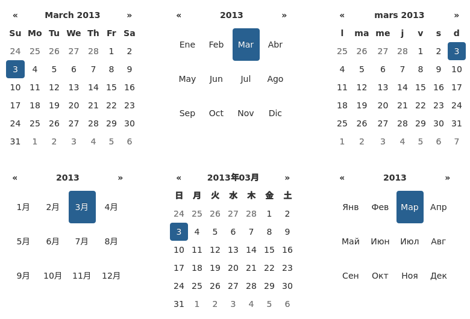

I18N
====

The plugin supports i18n for the month and weekday names and the ``weekStart`` option.  The default is English ("en"); other available translations are available in the ``js/locales/`` directory, simply include your desired locale after the plugin.  To add more languages, simply add a key to ``$.fn.datepicker.dates``, before calling ``.datepicker()``.  Example

::

    $.fn.datepicker.dates['en'] = {
        days: ["Sunday", "Monday", "Tuesday", "Wednesday", "Thursday", "Friday", "Saturday"],
        daysShort: ["Sun", "Mon", "Tue", "Wed", "Thu", "Fri", "Sat"],
        daysMin: ["Su", "Mo", "Tu", "We", "Th", "Fr", "Sa"],
        months: ["January", "February", "March", "April", "May", "June", "July", "August", "September", "October", "November", "December"],
        monthsShort: ["Jan", "Feb", "Mar", "Apr", "May", "Jun", "Jul", "Aug", "Sep", "Oct", "Nov", "Dec"],
        today: "Today",
        clear: "Clear",
        format: "mm/dd/yyyy",
        titleFormat: "MM yyyy", /* Leverages same syntax as 'format' */
        weekStart: 0
    };

Right-to-left languages may also include ``rtl: true`` to make the calendar display appropriately.

If your browser (or those of your users) is displaying characters wrong, chances are the browser is loading the javascript file with a non-unicode encoding.  Simply add ``charset="UTF-8"`` to your ``script`` tag:

.. code-block:: html

    

::

    $('.datepicker').datepicker({
        language: 'XX'
    });

