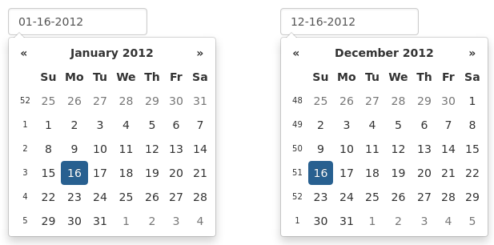
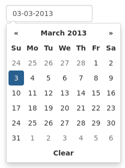
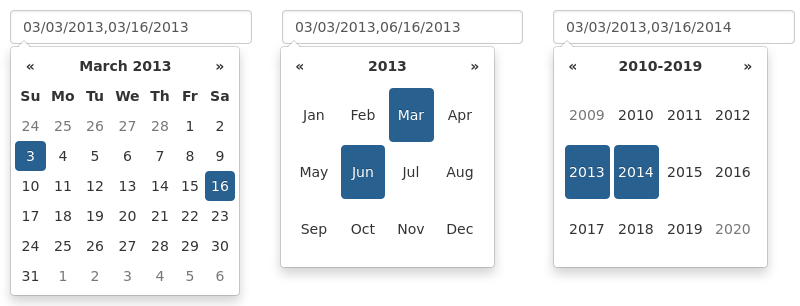

Options
=======

All options that take a "Date" can handle a ``Date`` object; a String formatted according to the given ``format``; or a timedelta relative to today, eg "-1d", "+6m +1y", etc, where valid units are "d" (day), "w" (week), "m" (month), and "y" (year). Use "0" as today.
There are also aliases for the relative timedelta's: "yesterday" equals "-1d", "today" is equal to "+0d" and "tomorrow" is equal to "+1d".

Most options can be provided via data-attributes.  An option can be converted to a data-attribute by taking its name, replacing each uppercase letter with its lowercase equivalent preceded by a dash, and prepending "data-date-" to the result.  For example, ``startDate`` would be ``data-date-start-date``, ``format`` would be ``data-date-format``, and ``daysOfWeekDisabled`` would be ``data-date-days-of-week-disabled``.

See the `quick reference`_ for an overview of all options and their default values

autoclose
---------

Boolean.  Default: false

Whether or not to close the datepicker immediately when a date is selected.

assumeNearbyYear
----------------

Boolean or Integer.  Default: false

If true, manually-entered dates with two-digit years, such as "5/1/15", will be parsed as "2015", not "15". If the year is less than 10 years in advance, the picker will use the current century, otherwise, it will use the previous one. For example "5/1/15" would parse to May 1st, 2015, but "5/1/97" would be May 1st, 1997.

To configure the number of years in advance that the picker will still use the current century, use an Integer instead of the Boolean true. E.g. "assumeNearbyYear: 20"

beforeShowDay
-------------

Function(Date).  Default: $.noop

A function that takes a date as a parameter and returns one of the following values:

 * undefined to have no effect
 * A Boolean, indicating whether or not this date is selectable
 * A String representing additional CSS classes to apply to the date's cell
 * An object with the following properties:

   * ``enabled``: same as the Boolean value above
   * ``classes``: same as the String value above
   * ``tooltip``: a tooltip to apply to this date, via the ``title`` HTML attribute
   * ``content``: the content to display in the day cell, rather than the default (day of month as text)

beforeShowMonth
---------------

Function(Date).  Default: $.noop

A function that takes a date as a parameter and returns one of the following values:

 * undefined to have no effect
 * A Boolean, indicating whether or not this month is selectable
 * A String representing additional CSS classes to apply to the month's cell
 * An object with the following properties:

   * ``enabled``: same as the Boolean value above
   * ``classes``: same as the String value above
   * ``tooltip``: a tooltip to apply to this date, via the ``title`` HTML attribute

beforeShowYear
--------------

Function(Date).  Default: $.noop

A function that takes a date as a parameter and returns one of the following values:

 * undefined to have no effect
 * A Boolean, indicating whether or not this year is selectable
 * A String representing additional CSS classes to apply to the year's cell
 * An object with the following properties:

   * ``enabled``: same as the Boolean value above
   * ``classes``: same as the String value above
   * ``tooltip``: a tooltip to apply to this year, via the ``title`` HTML attribute

beforeShowDecade
----------------

Function(Date).  Default: $.noop

A function that takes a date as a parameter and returns one of the following values:

 * undefined to have no effect
 * A Boolean, indicating whether or not this year is selectable
 * A String representing additional CSS classes to apply to the year's cell
 * An object with the following properties:

   * ``enabled``: same as the Boolean value above
   * ``classes``: same as the String value above
   * ``tooltip``: a tooltip to apply to this year, via the ``title`` HTML attribute

beforeShowCentury
-----------------

Function(Date).  Default: $.noop

A function that takes a date as a parameter and returns one of the following values:

 * undefined to have no effect
 * A Boolean, indicating whether or not this year is selectable
 * A String representing additional CSS classes to apply to the year's cell
 * An object with the following properties:

   * ``enabled``: same as the Boolean value above
   * ``classes``: same as the String value above
   * ``tooltip``: a tooltip to apply to this year, via the ``title`` HTML attribute

calendarWeeks
-------------

Boolean. Default: false

Whether or not to show week numbers to the left of week rows.

clearBtn
--------

Boolean.  Default: false

If true, displays a "Clear" button at the bottom of the datepicker to clear the input value. If "autoclose" is also set to true, this button will also close the datepicker.

container
---------

String.  Default: "body"

Appends the date picker popup to a specific element; eg: container: '#picker-container' (will default to "body")

.. _datesDisabled:

datesDisabled
-------------

String, Array.  Default: []

Array of date strings or a single date string formatted in the given date format

.. _daysOfWeekDisabled:

daysOfWeekDisabled
------------------

String, Array.  Default: []

Days of the week that should be disabled. Values are 0 (Sunday) to 6 (Saturday). Multiple values should be comma-separated. Example: disable weekends: ``'06'`` or ``'0,6'`` or ``[0,6]``.

.. figure:: _static/screenshots/option_daysofweekdisabled.png
    :align: center

.. _daysOfWeekHighlighted:

daysOfWeekHighlighted
---------------------

String, Array.  Default: []

Days of the week that should be highlighted. Values are 0 (Sunday) to 6 (Saturday). Multiple values should be comma-separated. Example: highlight weekends: ``'06'`` or ``'0,6'`` or ``[0,6]``.

defaultViewDate
---------------

Date, String or Object with keys ``year``, ``month``, and ``day``. Default: today

Date to view when initially opening the calendar. The internal value of the date remains today as default, but when the datepicker is first opened the calendar will open to ``defaultViewDate`` rather than today. If this option is not used, "today" remains the default view date.

This option can be:
 * A date, which should be in local timezone.
 * A string which must be parsable with ``format``.
 * An object with keys ``year``, ``month`` and ``day`` (can't be set from a data attribute). If the given object is missing any of the required keys, their defaults are:

   * ``year``: the current year
   * ``month``: 0 (Note that it starts with 0 for January)
   * ``day``: 1

disableTouchKeyboard
--------------------

Boolean.  Default: false

If true, no keyboard will show on mobile devices

enableOnReadonly
----------------

Boolean. Default: true

If false the datepicker will not show on a readonly datepicker field.

.. _endDate:

endDate
-------

Date or String.  Default: End of time

The latest date that may be selected; all later dates will be disabled.

Date should be in local timezone. String must be parsable with ``format``.

.. figure:: _static/screenshots/option_enddate.png
    :align: center

.. code-block:: html

    <input type="text" class="form-control" data-date-end-date="0d">

Will disable all dates after today.

forceParse
----------

Boolean.  Default: true

Whether or not to force parsing of the input value when the picker is closed.  That is, when an invalid date is left in the input field by the user, the picker will forcibly parse that value, and set the input's value to the new, valid date, conforming to the given `format`.

format
------

String.  Default: "mm/dd/yyyy"

The date format, combination of d, dd, D, DD, m, mm, M, MM, yy, yyyy.

* d, dd: Numeric date, no leading zero and leading zero, respectively.  Eg, 5, 05.
* D, DD: Abbreviated and full weekday names, respectively.  Eg, Mon, Monday.
* m, mm: Numeric month, no leading zero and leading zero, respectively.  Eg, 7, 07.
* M, MM: Abbreviated and full month names, respectively.  Eg, Jan, January
* yy, yyyy: 2- and 4-digit years, respectively.  Eg, 12, 2012.

Object.

Custom formatting options

* toDisplay: function (date, format, language) to convert date object to string, that will be stored in input field
* toValue: function (date, format, language) to convert string object to date, that will be used in date selection

::

    $('.datepicker').datepicker({
        format: {
            /*
             * Say our UI should display a week ahead,
             * but textbox should store the actual date.
             * This is useful if we need UI to select local dates,
             * but store in UTC
             */
            toDisplay: function (date, format, language) {
                var d = new Date(date);
                d.setDate(d.getDate() - 7);
                return d.toISOString();
            },
            toValue: function (date, format, language) {
                var d = new Date(date);
                d.setDate(d.getDate() + 7);
                return new Date(d);
            }
        }
    });

immediateUpdates
----------------

Boolean. Default: false

If true, selecting a year or month in the datepicker will update the input value immediately. Otherwise, only selecting a day of the month will update the input value immediately.

inputs
------

Array, jQuery. Default: None

A list of inputs to be used in a range picker, which will be attached to the selected element.  Allows for explicitly creating a range picker on a non-standard element.

.. code-block:: html

    

        <input type="text" class="actual_range">
        <input type="text" class="actual_range">
    

::

    $('#event_period').datepicker({
        inputs: $('.actual_range')
    });

keepEmptyValues
---------------

Boolean. Default: false

Only effective in a range picker. If true, the selected value does not get propagated to other, currently empty, pickers in the range.

keyboardNavigation
------------------

Boolean.  Default: true

Whether or not to allow date navigation by arrow keys.

Keyboard navigation is not supported at all for embedded / inline mode. Also it's not working if input element hasn't focus. This could be an issue if used as component or if opened by `show` method.

language
--------

String.  Default: "en"

The IETF code (eg  "en" for English, "pt-BR" for Brazilian Portuguese) of the language to use for month and day names.  These will also be used as the input's value (and subsequently sent to the server in the case of form submissions).  If a full code (eg "de-DE") is supplied the picker will first check for an "de-DE" language and if not found will fallback and check for a "de" language.  If an unknown language code is given, English will be used.  See :doc:`i18n`.

.. figure:: _static/screenshots/option_language.png
    :align: center

maxViewMode
-----------

Number, String.  Default: 4, "centuries"

Set a maximum limit for the view mode.  Accepts: 0 or "days" or "month", 1 or "months" or "year", 2 or "years" or "decade", 3 or "decades" or "century", and 4 or "centuries" or "millenium".
Gives the ability to pick only a day, a month, a year or a decade.  The day is set to the 1st for "months", the month is set to January for "years", the year is set to the first year from the decade for "decades", and the year is set to the first from the millennium for "centuries".

minViewMode
-----------

Number, String.  Default: 0, "days"

Set a minimum limit for the view mode.  Accepts: 0 or "days" or "month", 1 or "months" or "year", 2 or "years" or "decade", 3 or "decades" or "century", and 4 or "centuries" or "millenium".
Gives the ability to pick only a month, a year or a decade.  The day is set to the 1st for "months", and the month is set to January for "years", the year is set to the first year from the decade for "decades", and the year is set to the first from the millennium for "centuries".

multidate
---------

Boolean, Number.  Default: false

Enable multidate picking.  Each date in month view acts as a toggle button, keeping track of which dates the user has selected in order.  If a number is given, the picker will limit how many dates can be selected to that number, dropping the oldest dates from the list when the number is exceeded.  ``true`` equates to no limit.  The input's value (if present) is set to a string generated by joining the dates, formatted, with ``multidateSeparator``.

For selecting 2 dates as a range please see :ref:`daterange`

multidateSeparator
------------------

String.  Default: ","

The string that will appear between dates when generating the input's value.  When parsing the input's value for a multidate picker, this will also be used to split the incoming string to separate multiple formatted dates; as such, it is highly recommended that you not use a string that could be a substring of a formatted date (eg, using '-' to separate dates when your format is 'yyyy-mm-dd').

orientation
-----------

String.  Default: "auto"

A space-separated string consisting of one or two of "left" or "right", "top" or "bottom", and "auto" (may be omitted); for example, "top left", "bottom" (horizontal orientation will default to "auto"), "right" (vertical orientation will default to "auto"), "auto top".  Allows for fixed placement of the picker popup.

"orientation" refers to the location of the picker popup's "anchor"; you can also think of it as the location of the trigger element (input, component, etc) relative to the picker.

"auto" triggers "smart orientation" of the picker.  Horizontal orientation will default to "left" and left offset will be tweaked to keep the picker inside the browser viewport; vertical orientation will simply choose "top" or "bottom", whichever will show more of the picker in the viewport.

showOnFocus
-----------

Boolean.  Default: true

If false, the datepicker will be prevented from showing when the input field associated with it receives focus.

.. _startdate:

startDate
---------

Date or String.  Default: Beginning of time

The earliest date that may be selected; all earlier dates will be disabled.

Date should be in local timezone. String must be parsable with ``format``.

.. figure:: _static/screenshots/option_startdate.png
    :align: center

startView
---------

Number, String.  Default: 0, "days"

The view that the datepicker should show when it is opened.  Accepts: 0 or "days" or "month", 1 or "months" or "year", 2 or "years" or "decade", 3 or "decades" or "century", and 4 or "centuries" or "millenium".  Useful for date-of-birth datepickers.

templates
---------

Object. Default:

::

    {
        leftArrow: '&laquo;',
        rightArrow: '&raquo;'
    }

The templates used to generate some parts of the picker. Each property must be a string with only text, or valid html.
You can use this property to use custom icons libs. for example:

::

    {
        leftArrow: '<i class="fa fa-long-arrow-left"></i>',
        rightArrow: '<i class="fa fa-long-arrow-right"></i>'
    }

showWeekDays
------------

Boolean.  Default: true

If false, the datepicker will not append the names of the weekdays to its view. Default behavior is appending the weekdays.

title
-----

String. Default: ""

The string that will appear on top of the datepicker. If empty the title will be hidden.

todayBtn
--------

Boolean, "linked".  Default: false

If true or "linked", displays a "Today" button at the bottom of the datepicker to select the current date.  If true, the "Today" button will only move the current date into view; if "linked", the current date will also be selected.

todayHighlight
--------------

Boolean.  Default: false

If true, highlights the current date.

.. figure:: _static/screenshots/option_todayhighlight.png
    :align: center

toggleActive
------------

Boolean. Default: false

If true, selecting the currently active date in the datepicker will unset the respective date. This option is always true when the multidate option is being used.

updateViewDate
--------------

Boolean. Default: true

If false viewDate is set according to `value` on initialization and updated
* if a day in last oder next month is selected or
* if dates are changed by `setDate`, `setDates`, `setUTCDate` and `setUTCDates` methods.
If `multidate` option is `true` the last selected date or the last date in array
passed to `setDates` or `setUTCDates` is used.

weekStart
---------

Integer.  Default: 0

Day of the week start. 0 (Sunday) to 6 (Saturday)

.. figure:: _static/screenshots/option_weekstart.png
    :align: center

zIndexOffset
------------

Integer.  Default: 10

The CSS z-index of the open datepicker is the maximum z-index of the input and all of its DOM ancestors *plus* the ``zIndexOffset``.

Quick reference
===============

This is a quick overview of all the options and their default values

=====================        =============
Option                       Default value
=====================        =============
autoclose                    false
assumeNearbyYear             false
beforeShowDay
beforeShowMonth
beforeShowYear
beforeShowDecade
beforeShowCentury
calendarWeeks                false
clearBtn                     false
container                    'body'
datesDisabled                []
daysOfWeekDisabled           []
daysOfWeekHighlighted        []
defaultViewDate              today
disableTouchKeyboard         false
enableOnReadonly             true
endDate                      Infinity
forceParse                   true
format                       'mm/dd/yyyy'
immediateUpdates             false
inputs
keepEmptyValues              false
keyboardNavigation           true
language                     'en'
maxViewMode                  4 'centuries'
minViewMode                  0 'days'
multidate                    false
multidateSeparator           ','
orientation                  'auto'
showOnFocus                  true
startDate                    -Infinity
startView                    0 'days' (current month)
templates
title                        ''
todayBtn                     false
todayHighlight               true
toggleActive                 false
weekStart                    0 (Sunday)
zIndexOffset                 10
=====================        =============
